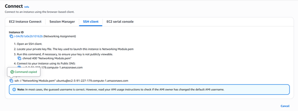
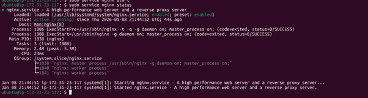

## Process

This section documents the steps taken to complete the networking assignment from start to finish.

## Step 1: Domain Registration

Purchased a custom domain using AWS Route 53.

Confirmed the domain was successfully registered and visible in the Route 53 console.

Created a public hosted zone for the domain.

Purpose:
To enable DNS management and allow the domain to be mapped to cloud infrastructure.

## Step 2: EC2 Instance Deployment

Launched a new EC2 instance with the following configuration:

OS: Ubuntu

Instance type: t3.micro

Key pair: newly created .pem key

Configured a security group to allow:

HTTP (port 80)

Purpose:
To provision a virtual server that will host the web application.

## Step 3: Secure Server Access (SSH)

Moved the .pem key into the Linux filesystem.

Updated permissions using chmod 400.

Connected to the instance via SSH using the public IPv4 address.

Purpose:
To securely access and manage the EC2 instance.

## Step 4: Web Server Installation (NGINX)

Updated system packages.

Installed NGINX using apt.

Started and enabled the NGINX service.

Purpose:
To host a web server capable of serving HTTP traffic.

## Step 5: DNS Configuration

Created an A record in the Route 53 hosted zone.

Pointed the domain to the EC2 public IPv4 address.

Verified name servers matched between the domain and hosted zone.

Purpose:
To allow the domain name to resolve to the EC2 instance.

## Step 6: Testing and Validation

Verified the NGINX page loaded using the EC2 public IP.

Confirmed the site was accessible using the custom domain over HTTP.

Purpose:
To ensure the full network flow worked as expected.

## Final Outcome

The web server is successfully accessible via a custom domain, demonstrating practical understanding of:

DNS resolution

IP addressing

Cloud networking

Security groups

HTTP traffic flow